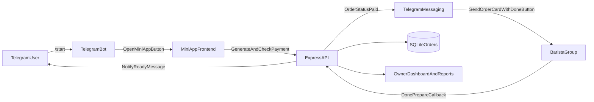

# Telegram Mini App + Bot Integration Plan

## Assumptions
- Scope is **MVP first**: `/start` welcome + open mini app button, payment success to barista group, barista "Done Prepare" action, and user order-status notification.
- Bot logic will run in the **existing Node backend**.
- The exposed bot token will be rotated and moved to environment variables before deployment.

## Security First
- Revoke the exposed token via BotFather and issue a new token.
- Store secrets in `.env` only (`TELEGRAM_BOT_TOKEN`, `TELEGRAM_BARISTA_GROUP_ID`).
- Add startup validation to fail fast when Telegram env vars are missing in production mode.

## Architecture (MVP)

## Backend Changes
- **Add Telegram bot service + routes**
  - Create [`server/services/telegramBot.js`](server/services/telegramBot.js) for:
    - bot init and command handlers (`/start`)
    - send message helpers (user + group)
    - inline keyboard callback handling for "Done Prepare"
  - Register webhook/callback route in [`server/index.js`](server/index.js), e.g. `POST /api/telegram/webhook` (or polling mode for local dev).

- **Persist chat mapping and status history**
  - Extend [`server/db.js`](server/db.js) with:
    - `telegram_users(user_id TEXT PRIMARY KEY, chat_id TEXT, username TEXT, updated_at TEXT)`
    - `order_events(id, order_id, event_type, payload_json, created_at)`
    - `orders.prepare_status` (`pending_prepare|preparing|ready`) and `prepared_at`
  - Add helper methods:
    - `upsertTelegramUser(...)`
    - `markOrderPreparing(...)`, `markOrderReady(...)`
    - `appendOrderEvent(...)`

- **Hook into existing payment lifecycle**
  - In [`server/controllers/generateKhqrController.js`](server/controllers/generateKhqrController.js):
    - include `orderId` in response (already available)
    - optionally persist initial order metadata from frontend (items summary)
  - In [`server/controllers/verifyPaymentController.js`](server/controllers/verifyPaymentController.js):
    - after `markOrderPaid(...)`, send barista group message with inline "Done Prepare" button containing `orderId`
    - send confirmation/status message to user chat when available

- **Add order API for richer payload from mini app**
  - New endpoint in [`server/index.js`](server/index.js): `POST /api/orders/create` to store cart line items + user details before payment starts.
  - Optional table: `order_items(id, order_id, name, qty, unit_price, options_json)` in [`server/db.js`](server/db.js).

## Frontend Changes
- **Replace external webhook beacon with backend order API**
  - Update [`frontend/src/components/LumhoTelegramMenu.jsx`](frontend/src/components/LumhoTelegramMenu.jsx):
    - remove `ORDER_WEBHOOK` image-based submission
    - call backend `POST /api/orders/create` with cart/items/user metadata
    - continue using [`frontend/src/components/KhqrOrderPayCard.jsx`](frontend/src/components/KhqrOrderPayCard.jsx) for payment generation/check
- **Send Telegram web app identity proof**
  - Include `initData`/`initDataUnsafe` fields from Telegram WebApp to backend for user linking and verification.

## Reporting + Owner Dashboard (Phase-1 within same repo)
- **Reporting API**
  - Add endpoints in [`server/index.js`](server/index.js):
    - `GET /api/reports/daily-summary`
    - `GET /api/reports/orders?status=&from=&to=&userId=`
    - `GET /api/reports/failures` (expired/unpaid/error cases)
- **Dashboard UI**
  - Add owner view pages/components under [`frontend/src/components`](frontend/src/components):
    - order timeline (pending -> paid -> preparing -> ready)
    - KPI cards (orders, revenue, avg prep time, failure rate)
    - filters for date/user/status and raw event log view for troubleshooting

## Observability and Reliability
- Add structured logs around payment check, Telegram send, callback actions, and status transitions.
- Enforce idempotency for callback clicks (ignore repeated "Done Prepare" actions after ready).
- Add retry/backoff for Telegram send failures and capture failure events in DB.

## Delivery Sequence
1. Security + env hardening.
2. DB migrations/helpers for Telegram mapping and order statuses.
3. Telegram bot service + `/start` + open mini app button.
4. Payment-success to barista group + done button callback -> user notification.
5. Replace frontend external webhook with backend `orders/create` flow.
6. Reporting endpoints.
7. Owner dashboard UI.
8. End-to-end tests and runbook documentation.

## Key Files To Modify
- [`server/index.js`](server/index.js)
- [`server/db.js`](server/db.js)
- [`server/controllers/generateKhqrController.js`](server/controllers/generateKhqrController.js)
- [`server/controllers/verifyPaymentController.js`](server/controllers/verifyPaymentController.js)
- [`frontend/src/components/LumhoTelegramMenu.jsx`](frontend/src/components/LumhoTelegramMenu.jsx)
- [`frontend/src/components/KhqrOrderPayCard.jsx`](frontend/src/components/KhqrOrderPayCard.jsx)
- New: [`server/services/telegramBot.js`](server/services/telegramBot.js)
- New: reporting routes/service files under [`server`](server)
- New: owner dashboard components under [`frontend/src/components`](frontend/src/components)
